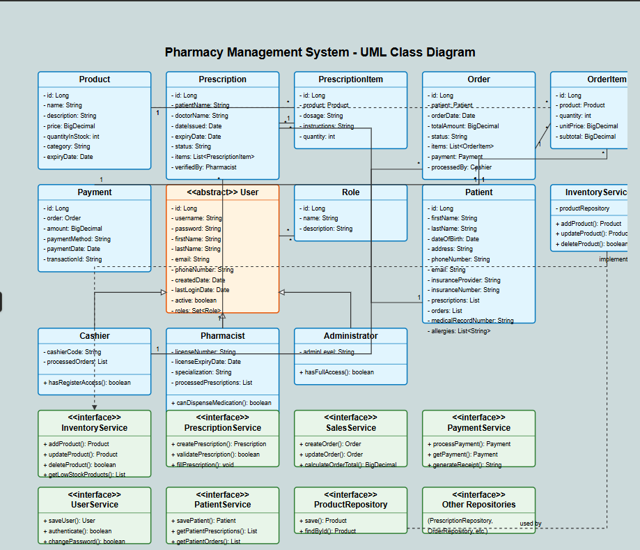

# Pharmacy management system using java
//payment and order should have the same id.
## Overview

The Pharmacy Management System is a comprehensive solution designed to streamline pharmacy operations. It offers functionality for inventory management, prescription processing, sales transactions, and payment handling. This system is built with a clean, layered architecture focusing on core business logic without the complexity of web controllers.

## System Architecture

### Entity Classes
- **Product**: Medications and supplies
- **Prescription/PrescriptionItem**: Doctor prescriptions with associated medications
- **Order/OrderItem**: Customer purchases
- **Payment**: Financial transactions
- **User (abstract)**: Base class for system users
  - **Pharmacist**: Licensed medication dispensers
  - **Cashier**: Handles sales transactions
  - **Administrator**: System manager
- **Patient**: Customer who receives prescriptions and makes purchases

### Service Layer
Services contain all business logic:
- **InventoryService**: Manage products and stock levels
- **PrescriptionService**: Process and validate prescriptions
- **SalesService**: Handle customer orders
- **PaymentService**: Process payments and generate receipts
- **UserService**: Manage system users
- **PatientService**: Manage patient records

### Repository Layer
Repositories handle data persistence:
- **ProductRepository**: Store product information
- **PrescriptionRepository**: Store prescription records
- **OrderRepository**: Store customer orders
- **PaymentRepository**: Store payment transactions
- **UserRepository**: Store user accounts
- **PatientRepository**: Store patient information

## How It Works

1. **Inventory Management**
   - Pharmacists add new medications to inventory
   - System tracks stock levels and alerts on low inventory
   - Products can be categorized and priced

2. **Prescription Processing**
   - Patients bring prescriptions to the pharmacy
   - Pharmacists enter prescription details into the system
   - System validates prescription (dosage, interactions)
   - Pharmacist dispenses medication

3. **Sales Processing**
   - Cashiers create orders for customers
   - System calculates totals
   - Items are deducted from inventory

4. **Payment Handling**
   - System processes various payment methods
   - Receipts are generated
   - Payment records are stored

## Benefits

- **Simplified Architecture**: No web controllers or complex dependencies
- **Clean Separation**: Business logic isolated from data access
- **Extensible Design**: Easy to add new features
- **Maintainable Code**: Clear responsibilities for each component

## Future Enhancements

- Barcode scanning integration
- Insurance processing
- Reporting and analytics
- Multi-branch support
- User authentication and authorization
